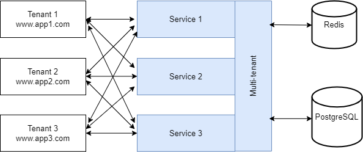

We will also be using a Table-based multi-tenancy model that saves the most on
operational costs, sharing a database between tenants uses hardware efficiently
and reduces your infrastructure code and maintenance overhead.

In the Table-based multi-tenancy model, every row in every table is associated
with a partitioning key (usually the tenant identifier) and restricts data
access using Row Level Security (RLS for short), consequently, we don't need to
worry about which schema or database it is connecting to. For this and other
security and monitoring reasons, you should have your application connect to the
database as a user other than the owner of the database objects because
PostgreSQL super users and any role created with the `BYPASSRLS`attribute aren't
subject to table policies. With this in mind, we will be creating a CRUD
database user that can onUPDATEEATE, READ, UPDATE, and DELETE.
